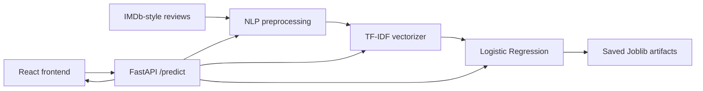

# Movie Sentiment Analysis System

## Overview

A simple end-to-end machine learning web application that classifies a movie review as **Positive** or **Negative**. A React page sends a review to a FastAPI API. The API applies the same NLP preprocessing used in training, transforms the text with TF-IDF, and uses Logistic Regression to return a label and confidence score.

## Features

- Movie review sentiment classification
- Reusable NLTK text preprocessing
- TF-IDF feature extraction and Logistic Regression
- Saved model/vectorizer with Joblib
- Confusion-matrix evaluation chart and metrics file
- FastAPI REST API with validation and CORS
- Clean one-page React interface

## Architecture



## Technologies

| Technology | Purpose |
| --- | --- |
| Pandas / NumPy | Dataset and numerical data handling |
| NLTK | Tokenization and English stopword removal |
| Scikit-learn | TF-IDF, train/test split, Logistic Regression, metrics |
| Matplotlib / Seaborn | Confusion-matrix visualization |
| Joblib | Save and load the trained model and vectorizer |
| FastAPI / Pydantic | Prediction API and request validation |
| React / Vite | Simple browser interface |

## Dataset

The repository includes `data/sample_imdb_reviews.csv`, a tiny balanced IMDb-style sample for an immediate demo. It is deliberately small, so its evaluation result is only a demonstration and not an IMDb benchmark score. For a real portfolio experiment, download the [IMDb Dataset of 50K Movie Reviews](https://www.kaggle.com/datasets/lakshmi25npathi/imdb-dataset-of-50k-movie-reviews), put it at `data/imdb_dataset.csv`, update `DATA_PATH` in `ml/train.py`, and retrain. The large file is ignored by Git.

## Installation (Windows)

```powershell
python -m venv venv
venv\Scripts\activate
pip install -r backend/requirements.txt
python ml/train.py
```

## Run the backend

From the project root, after training:

```powershell
uvicorn backend.main:app --reload
```

The API will be available at `http://localhost:8000`; interactive docs are at `http://localhost:8000/docs`.

## Run the frontend

In another terminal:

```powershell
cd frontend
npm install
npm run dev
```

Open the URL Vite prints (normally `http://localhost:5173`).

## API documentation

### `GET /health`

Response:

```json
{"status": "ok"}
```

### `POST /predict`

Request:

```json
{"review": "The movie was amazing and I loved it."}
```

Response shape:

```json
{"review": "The movie was amazing and I loved it.", "sentiment": "Positive", "confidence": 0.94}
```

`confidence` is the model probability for its predicted label, so its actual value varies by review and training data. Empty reviews are rejected with a validation error.

## ML workflow

1. Load review and sentiment columns with Pandas.
2. Lowercase text; remove HTML, punctuation, and non-letter characters.
3. Tokenize, remove English stopwords, and rebuild cleaned text.
4. Convert `positive` to 1 and `negative` to 0.
5. Create a reproducible stratified train/test split.
6. Fit TF-IDF on the training reviews.
7. Train Logistic Regression, predict the test set, and calculate metrics.
8. Save artifacts to `backend/model/` and results to `results/`.

## Model performance

The training run included with this project used the checked-in small sample (75 training / 25 test reviews, `random_state=42`) and produced:

| Metric | Result |
| --- | --- |
| Accuracy | 0.8800 |
| Precision | 0.8462 |
| Recall | 0.9167 |
| F1 score | 0.8800 |

These are actual generated values, not hardcoded claims. Run `python ml/train.py` to reproduce them; the script writes metrics to `results/model_metrics.txt` and a chart to `results/confusion_matrix.png`. Results will differ when using another dataset.

## Project structure

```text
backend/       FastAPI API, schemas, requirements, generated model artifacts
data/          small sample CSV and dataset instructions
frontend/      React/Vite user interface
ml/            preprocessing, training, and evaluation scripts
notebooks/     interview-friendly ML walkthrough notebook
results/       generated metrics and confusion matrix
```
